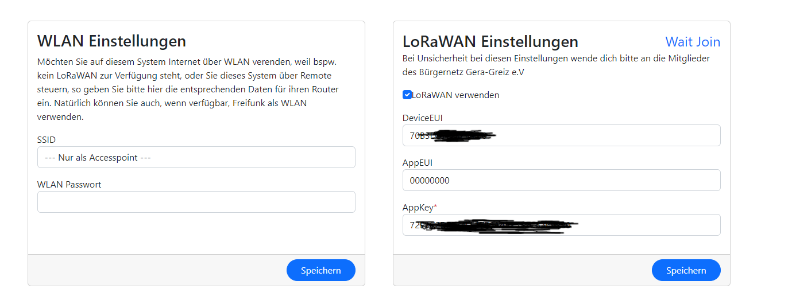

# BNG ESP32 LoRa


**WLAN & LoRaWAN - Feinstaub, Temperatur, Luftfeuchtigkeit Messsensor**
## Inhalt
- [BNGESP32LORA](#bngesp32lora)
	- [Inhalt](#inhalt)
	- [Installation](#installation)
		- [Verwendung von Visual Studio Code](#verwendung-von-visual-studio-code)
		- [Verwendung von PlatfornIO](#using-platformio)
		- [Vorbereitungen](#vorbereitungen)
	- [Erstellen des Projektes](#createproject)
	- [Erststart](#firststart)
		- [Wichtige Einstellungen](#neded-setup)
		- [Einstellungen des LoRaWANS](#setup-lora)
		- [Fehlersuche](#troubleshooting)
	- [Funktionen der Firmware](#firmware-features)
		- [Der integrierte Webserver](#integrated-webserver)
			- [Einschalten des Expertenmodus](#enable-expertmode)
		- [Remotekontrolle über TTN](#remotecontrol)
		- [Weiterführende Hinweise](#notices)

## Installation

### Verwendung von Visual Studio Code
Als IDE wird hierfür eine aktuelle Version von [Visual Studio Code](https://code.visualstudio.com/download) benötigt.
Außer der unten genannten Erweiterung "PlatformIO" sind noch weitere Erweiterungen für das Entwickeln mit C++ erforderlich. Weiterführende Informationen dazu gibt es reichlich im Internet.

### Verwendung von PlatformIO
Für das Entwickeln von Applikationen für Arduino-Boards u.a. ESP32/ESP8266 eignet sich unter Visual Studio Code 
[PlatformIO](http://platformio.org) hervoragend. Es kommt Bibliotheksmanager und voller Unterstützung für obige Boards daher.

1. Installation [Platform IDE](http://platformio.org/platform-ide)
2. Laden dieses Projektes unter "PlatformIO > Open Project"

Wichtig! Hierfür ist eine Internetverbindung notwendig, da Platform IO alle notwendigen Bibliotheken für dieses Projekt
herunter läd.

### Vorbereitungen
Bevor das Projekt erstellt werden kann, müssen ggf. noch einige wichtige Einstellungen vorgenommen werden.
Im ".pio Ordner" muss zunächst die Bibliothek AsyncTCP angepasst werden. hier besonders die Datei
.pio\libdeps\ttgo-lora32-v1\AsyncTCP@src-7fb2940bccb78b8d2de6915ae328b7fc\src\AsyncTCP.cpp`

In Zeile 98 ist der Wert von 32 auf 256 zu ändern

```cpp
static  inline  bool  _init_async_event_queue(){
	if(!_async_queue){
		_async_queue  =  xQueueCreate(256, sizeof(lwip_event_packet_t  *));
		if(!_async_queue){
			return  false;
		}
	}
	return  true;
}
```
Als letzte und ebenfalls wichtige Einstellung ist noch die LORA-Bibliothek anzupassen
`.pio\libdeps\ttgo-lora32-v1\MCCI LoRaWAN LMIC library\project_config\lmic_project_config.h`

Dort muss folgendes eingestellt (ausskommentiert) werden:
```cpp
// project-specific definitions
#define CFG_eu868 1
//#define CFG_us915 1
//#define CFG_au915 1
//#define CFG_as923 1
// #define LMIC_COUNTRY_CODE LMIC_COUNTRY_CODE_JP /* for as923-JP; also define CFG_as923 */
//#define CFG_kr920 1
//#define CFG_in866 1
//#define CFG_sx1276_radio 1
#define hal_init LMICHAL_init
//#define LMIC_USE_INTERRUPTS
```

## Erstellen des Projektes
Nachdem nun alle Vorbereitungen abgeschlossen sind kann das Projekt nun erstellt werden. Hierfür sind einige wichtige Schritte notwendig.
Im Projekt befindet sich ein Ordner "data", dieser muss ebenso mit in den Flash der MCU. Hierin befinden sich unter anderem  die HTML Dateien und die für den Webserver notwendigen Styles und Javascript-Dateien.


1. zuerst wird das Projekt kompiliert (Build)
2. wird das Filesystemimage (Ordner "data") erstellt.
3. das FileSystemImage in die MCU geladen
4. Die Firmware in die MCU geladen.

Wichtig ist, das beim Upload des Filesystemimages und beim Upload der Firmware, KEINE serielles Terminal geöffnet sein darf, da sonst die Übertragung scheitert.

## Erststart
Wenn alles geklappt hat, startet die MCU und im Terminal erscheinen nun einige Ausgaben, diese sind wichtig, da hier wichtige Informationen, wie bspw. erkannte I²C Komponenten aufgelistet werden.

```
[41][D][esp32-hal-cpu.c:244] setCpuFrequencyMhz(): PLL: 480 / 2 = 240 Mhz, APB: 80000000 Hz
[  1069][I][config_bng.cpp:100] loadConfig(): [src/config_bng.cpp] lade Geräteeinstellungen vom NVRAM...
[  1073][I][config_bng.cpp:129] loadConfig(): [src/config_bng.cpp] Konfiguration v0.36.676 geladen
[  1077][D][reset.cpp:68] do_after_reset(): [src/reset.cpp] setze Zeitzone auf CET-1CEST,M3.4.0/2,M10.4.0/3
[  1086][I][main.cpp:20] setup(): [src/main.cpp] Starte System v0.36.676 (Runmode=0 / Neustarts=0)
[  1095][I][main.cpp:21] setup(): [src/main.cpp] Firmwaredatum: 1690456583
[  1102][I][main.cpp:32] setup(): [src/main.cpp] ESP32 Chip mit 2 Kernen, WiFI/BT/BLE, Silicon Revision 1, 4MB Flash
[  1112][I][main.cpp:33] setup(): [src/main.cpp] Interner Totaler Heap 306472, interner freier Heap 275852
[  1121][I][main.cpp:34] setup(): [src/main.cpp] ChipRevision 1, Cpu Freq 240, SDK Version v4.4.4
[  1130][I][main.cpp:35] setup(): [src/main.cpp] Flash Size 4194304, Flash Speed 40000000
[  1138][I][main.cpp:36] setup(): [src/main.cpp] Wifi/BT software coexist version 1.2.0
[  1145][I][main.cpp:39] setup(): [src/main.cpp] IBM LMIC version 1.6.1468577746
[  1152][I][main.cpp:44] setup(): [src/main.cpp] Arduino LMIC version 4.1.1.0
[  1160][I][lorawan.cpp:147] printKey(): [src/lorawan.cpp] DevEUI: 70B3D57ED005EEB0
[  1167][I][lorawan.cpp:147] printKey(): [src/lorawan.cpp] AppEUI: 0000000000000000
[  1174][I][lorawan.cpp:147] printKey(): [src/lorawan.cpp] AppKey: 72E3C2DEF64FF17E6A482552CB3B9880
[  1183][I][esp32-hal-i2c.c:75] i2cInit(): Initialising I2C Master: sda=21 scl=13 freq=100000
[  1192][I][i2c.cpp:36] i2c_scan(): [src/i2c.cpp] Starte I2C Bus scan...
[  1198][W][Wire.cpp:301] begin(): Bus already started in Master Mode.
[  1345][I][i2c.cpp:67] i2c_scan(): [src/i2c.cpp] Gerät gefunden unter 0x39, type = Unknown
[  1357][I][i2c.cpp:67] i2c_scan(): [src/i2c.cpp] Gerät gefunden unter 0x76, type = BME280
[  1357][I][i2c.cpp:70] i2c_scan(): [src/i2c.cpp] 2 I2C Gerät(e) gefunden
```
Zuerst prüft die Firmware es im NVRAM eine gültige Konfiguration gibt, diese MUSS zur aktuellen Firmwareversion passen.
Sollte dies nicht der Fall sein, so wird eine "FactoryDefault-Konfiguration angelegt" Alle wichtigen Daten werden hier auf voreingestellte Werte gesetzt.

Sollte kein WLAN-Router konfiguriert/erreichbar sein, so startet die MCU im AccessPoint Modus. Dieser kann dann mit einem WLAN-fähigen Gerät verbunden werden. Die IP für die Webkonfiguration lautet standartmäßig IMMER http://192.168.4.1

### Wichtige Einstellungen
Im Idealfalle sollte die MCU, wenn vorhanden, ins interne WLAN eures Routers gesetzt werden, somit ist die Konfiguration um etwas leichter als von einem mobilen Gerät aus. Ist aber für den Betrieb nicht zwingend erforderlich, vorausgesetzt bei Euch ist LoRaWAN verfügbar.

Nach dem Speichern der WLAN-Einstellungen startet die MCU neu und versucht nun eine Verbindung zu eurem Router herzustellen. Sollte dies erfolgreich sein, wird Euch zu einem im Terminal, als auch auf dem Display die der MCU zugewiesene IP-Adresse anzeigen. Mit der Ihr euch über euer internes Netz weitere Einstellungen vornehmen könnt.

### Einstellungen des LoRaWANS
Die MCU sendet alle Messdaten per LoRa an TTN. Voraussetzung hierfür ist, das es ein entsprechender Gateway in Reichweite liegt. Sollte kein LoRaWAN verfügbar sein. so muss dann auf WLAN umgeswitscht werden.
Die wichtigsten Parameter hierfür sind die "DEVEUI", welche von der MCU erzeugt wird. Diese benötigen die Leute vom [Freifunk (buergernetz-gera-greiz.de)](https://www.buergernetz-gera-greiz.de/freifunk), damit sie diese in ihrer TTN-Console hinterlegen können. Der letzte wichtigste Parameter für LoRa ist der AppKey. Dieser Key wird Euch von obigen Leuten zur Verfügung gestellt und sollte nur auf Anweisung der Mitglieder vom Freifunk Gera-Greiz geändert werden. 
Beide Parameter sind für den Versand der Messdaten (Payload) sehr wichtig!



Ebenso ist es wichtig dem Gerät seine GPS-Daten mitzuteilen. Dies kann auf drei Arten geschehen.

1. per Eingabe von Latitude und Longitude im Dialog `GPS-Daten`
2. Bei verfügbarem Internet, also die MCU ist in eurem internen Netz (Router) angeschlossen. Kann man auch seine Adressdaten im Dialog `Adresse` eingeben und sich durch 'klick' auf `Prüfen` sich die GPS-Daten ermitteln lassen. Keine Angst die Adressdaten werden nirgends wo gespeichert oder weitergegeben.
3. Die MCU ist auch optional mit einem GPS-Modul bestückbar, hier besonders das Modul                                                     [GPS + BDS Beidou dual-modus modul, flight control positioning navigator, ATGM336H ersatz, für NEO-M8N - AliExpress](https://de.aliexpress.com/item/1005001512375345.html?spm=a2g0o.detail.0.0.1686d5Y1d5Y18G&gps-id=pcDetailTopMoreOtherSeller&scm=1007.40050.281175.0&scm_id=1007.40050.281175.0&scm-url=1007.40050.281175.0&pvid=2852215c-0a93-4722-b3b2-9c004135dbc5&_t=gps-id:pcDetailTopMoreOtherSeller,scm-url:1007.40050.281175.0,pvid:2852215c-0a93-4722-b3b2-9c004135dbc5,tpp_buckets:668%232846%238107%231934&pdp_npi=3%40dis%21EUR%215.35%214.7%21%21%21%21%21%40211b444016904656863148384eb79d%2112000016414464818%21rec%21DE%212450627250)
Die Beschaltung ist dem entsprechenden hier beiliegenden Schaltplan zu entnehmen.

Wenn alles richtig eingestellt ist versucht nun die MCU sich bei TTN zu Joinen dies ist auf der Weboberfläche ebenso zu erkennen.


Hier kann es nun je nach Reichweite eines Gateways und der Signalstärke, einige Zeit dauern. Im Idealfall sollte ihr auf der Weboberfläche nun folgendes Bild vorfinden....
[loraOk](docs/images/lw_joined.png)

Somit ist nun Euer System bereit und sendet von nun an seine Messdaten über LoRaWAN.